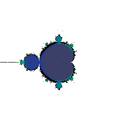
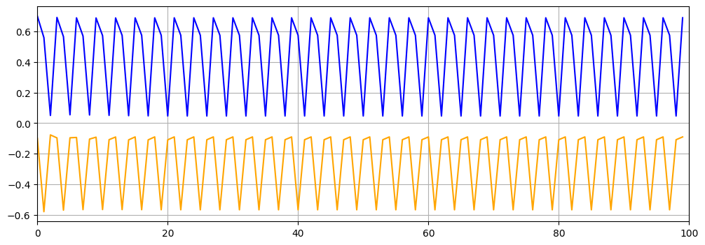

[](https://travis-ci.org/josecelano/mandelbrot-api)

# Mandelbrot API

This service is an API to generate two types of Mandelbrot images:
* Image tiles: a tile of the Mandelbrot Set fractal.
* Orbit graphs: graph representing the iterations values for a given Mandelbrot Set point, calculating recursively the formula `f(z) = z² + c` where `z` and `c` are complex numbers.

Sample image tile:  


Sample point orbit for point (-0.1,0.7) with period 3:


## Development

Setup (docker build)
```
./bin/dev-setup
```

Run API (dev mode):	
```	
./bin/dev-serve
```
And open http://0.0.0.0:5000/

## Usage

```
docker pull josecelano/mandelbrot-api
docker run -it --rm \
    -p 80:80 \
	-w /app \
    mandelbrot-api
```

## Related projects

This API uses these two command line applications:
* [Console command to generate tiles](https://github.com/josecelano/c-mandelbrot-arbitrary-precision)
* [Console command to generate orbits](https://github.com/josecelano/mandelbrot-orbit)
